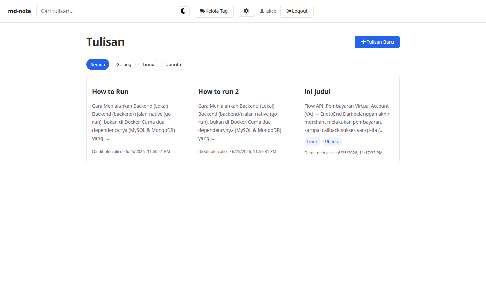
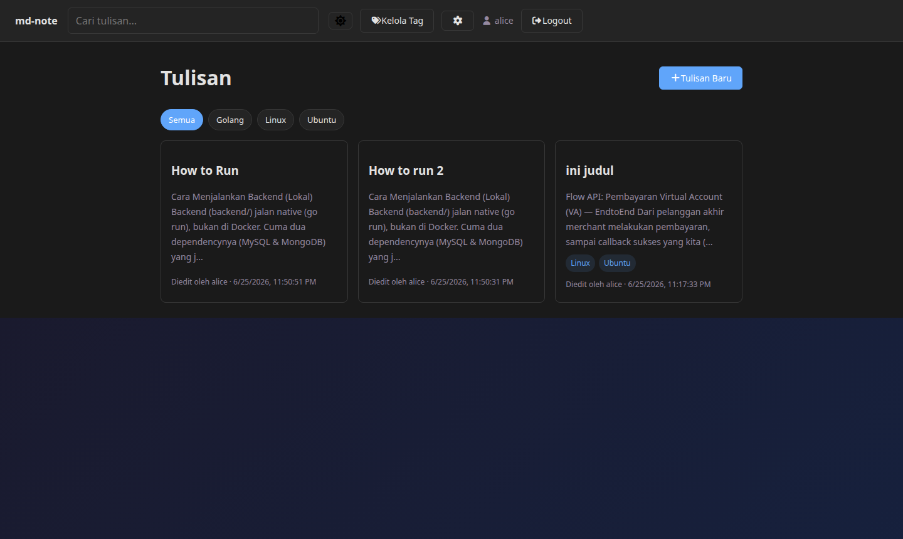
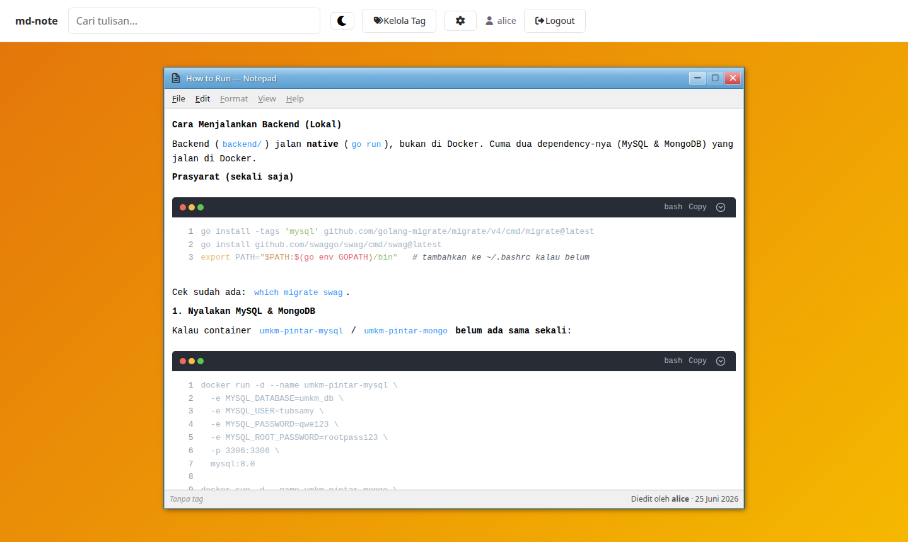
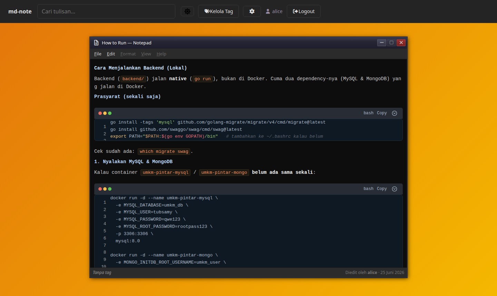
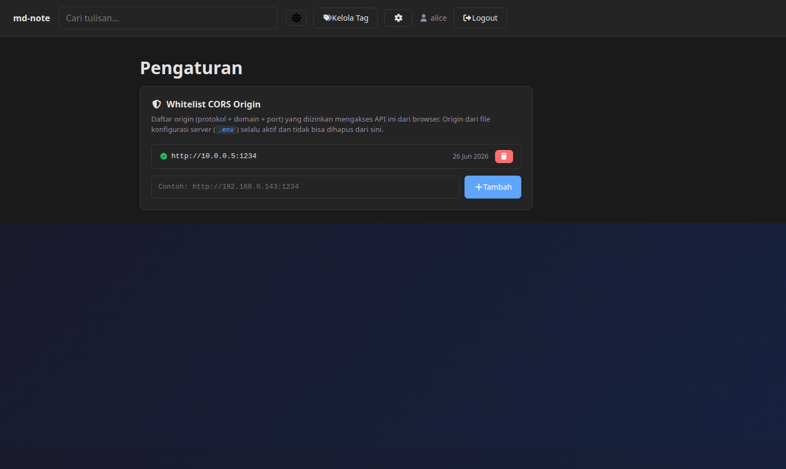

# md-note

Platform menulis berbasis Markdown dengan tampilan pembaca menyerupai **Windows Notepad**, mendukung kolaborasi publik (siapa pun yang login dapat membuat dan mengedit tulisan), serta dilengkapi dark mode, manajemen tag, dan whitelist CORS dinamis.

## Tampilan

### Dashboard

| Light | Dark |
|-------|------|
|  |  |

### Halaman Baca (Windows Notepad Style)

| Light | Dark |
|-------|------|
|  |  |

### Pengaturan — Whitelist CORS



---

## Fitur

- **Publik read** — pengunjung tanpa akun dapat membaca semua tulisan (model Wikipedia)
- **Kolaboratif** — semua pengguna yang login dapat membuat, mengedit, dan menghapus tulisan siapa pun
- **Editor Markdown** — split-pane live preview dengan md-editor-v3
- **Tampilan Notepad** — halaman baca menyerupai antarmuka Windows Notepad; lebar jendela dapat diatur dengan drag
- **Dark / Light mode** — toggle di NavBar, tersimpan di `localStorage`, mengikuti preferensi sistem secara default
- **Manajemen Tag** — CRUD tag dengan relasi many-to-many ke tulisan
- **Pencarian** — full-text search MySQL pada judul dan isi tulisan
- **Filter tag** — klik chip tag untuk menyaring tulisan
- **Whitelist CORS** — kelola daftar allowed origin melalui UI `/settings` tanpa restart server
- **Auth JWT** — register / login, token tersimpan di `localStorage`
- **Font Awesome** — ikon konsisten di seluruh UI

---

## Tech Stack

| Layer | Teknologi |
|-------|-----------|
| Frontend | Vue 3 + Vite, Pinia, Vue Router, md-editor-v3, Font Awesome Free |
| Backend | Go + Gin, GORM, golang-migrate |
| Database | MySQL 8.0 |
| Infra | Docker + Docker Compose |
| Web server | nginx (serve static build) |

---

## Menjalankan Aplikasi

### Prasyarat

- [Docker](https://docs.docker.com/get-docker/) & Docker Compose v2
- Port `1234` (frontend), `8081` (backend), `3309` (MySQL) tersedia di host

### Langkah

```bash
# 1. Clone repo
git clone git@github.com:raffiMRG/md-note.git
cd md-note

# 2. Salin dan sesuaikan environment
cp .env.example .env
# Edit .env — isi password, JWT secret, dan CORS_ORIGIN sesuai kebutuhan

# 3. Jalankan semua service
docker compose up -d --build

# 4. Buka di browser
#    Frontend : http://localhost:1234
#    API      : http://localhost:8081/api
```

### Variabel `.env` penting

| Variabel | Keterangan |
|----------|-----------|
| `DB_PASSWORD` | Password user MySQL |
| `DB_ROOT_PASSWORD` | Password root MySQL |
| `JWT_SECRET` | Secret untuk signing JWT (ganti dengan nilai acak yang kuat) |
| `CORS_ORIGIN` | Origin yang diizinkan, pisahkan dengan koma untuk beberapa origin |
| `VITE_API_BASE_URL` | URL API yang diakses browser, sesuaikan dengan IP/port backend |

### Akses dari jaringan lokal (LAN)

Tambahkan IP mesin host ke `CORS_ORIGIN` di `.env`:

```
CORS_ORIGIN=http://localhost:1234,http://192.168.0.xxx:1234
```

Atau tambahkan origin baru secara dinamis melalui halaman **Pengaturan** (`/settings`) tanpa perlu restart Docker.

### Akun default (seed awal)

Tidak ada seed otomatis — daftar akun baru melalui `/register`.

---

## Struktur Proyek

```
md-note/
├── docker-compose.yml
├── .env.example
├── backend/
│   ├── cmd/api/main.go
│   ├── internal/
│   │   ├── auth/          # JWT middleware & helper
│   │   ├── config/        # env var loading
│   │   ├── db/            # koneksi GORM + jalankan migrasi
│   │   ├── handlers/      # auth, notes, tags, cors
│   │   ├── models/        # User, Note, Tag, CORSOrigin
│   │   ├── repository/    # query layer
│   │   └── router/        # Gin routes + dynamic CORS cache
│   └── migrations/        # *.up.sql / *.down.sql
└── frontend/
    └── src/
        ├── api/           # axios client + endpoint modules
        ├── components/    # NavBar, NoteCard, TagFilterBar, TagInput, MarkdownPreview
        ├── composables/   # useTheme (dark/light)
        ├── router/        # Vue Router + auth guards
        ├── stores/        # Pinia: auth, notes
        └── views/         # Dashboard, NoteDetail, NoteEditor, TagManager, Settings, Login, Register
```

---

## API Endpoints

| Method | Path | Auth | Keterangan |
|--------|------|------|-----------|
| POST | `/api/auth/register` | — | Daftar akun baru |
| POST | `/api/auth/login` | — | Login, dapat JWT |
| GET | `/api/notes` | — | Daftar tulisan (publik) |
| GET | `/api/notes/search?q=` | — | Full-text search |
| GET | `/api/notes/:id` | — | Detail tulisan |
| POST | `/api/notes` | ✓ | Buat tulisan baru |
| PUT | `/api/notes/:id` | ✓ | Update tulisan |
| DELETE | `/api/notes/:id` | ✓ | Hapus tulisan |
| GET | `/api/tags` | — | Daftar tag |
| POST | `/api/tags` | ✓ | Buat tag |
| PUT | `/api/tags/:id` | ✓ | Update tag |
| DELETE | `/api/tags/:id` | ✓ | Hapus tag |
| GET | `/api/cors-origins` | — | Daftar origin whitelist DB |
| POST | `/api/cors-origins` | ✓ | Tambah origin |
| DELETE | `/api/cors-origins/:id` | ✓ | Hapus origin |

---

## Lisensi

MIT
